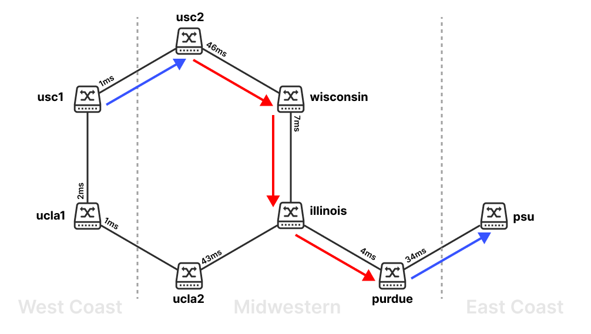
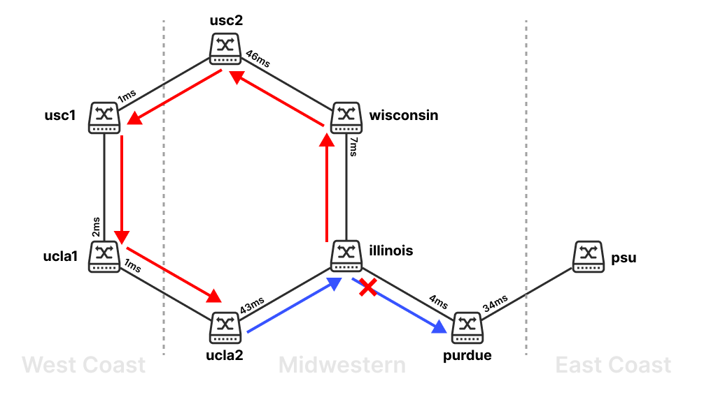
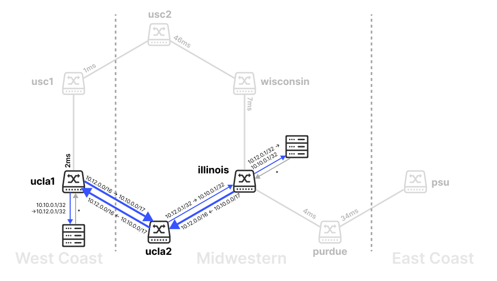

<h1 align="center">实验指导书（四）</h1>


[toc]

## 下载项⽬

```bash
git clone --recurse-submodules https://github.com/XJTU-NetVerify/sdn-lab4.git
cd sdn-lab4
```

安装依赖 / 运行步骤和[实验二](https://github.com/XJTU-NetVerify/sdn-lab2)相同。

注意，由于VeriFlow版本要求，这里需要使用Python 3.9版本，以及ryu控制器。
如果系统中没有Python 3.9，则需要通过：

```bash
uv python install 3.9
```

来安装。

## 实验目的

- 理解网络中网络故障出现的必然性
- 理解网络验证工具VeriFlow的原理
- 掌握VeriFlow的检测网络故障的方法
- 提高阅读工程代码、修改代码的能力

## 问题背景

你为ARPANET做出的贡献非常显著。你使用SDN的解决方案，使用最短时延路径、并且可以容忍链路故障的方式，在初期网络不稳定、高时延的性质，比那些用STP的人不知道高到哪里去了；于是，美国的网络开始按照你的建议，使用SDN作为底层架构。

时间来到2025年。威斯康辛大学麦迪逊分校（`wisconsin`）、伊利诺伊大学厄巴纳-香槟分校分校（`illinois`）、普渡大学（`purdue`）、宾夕法尼亚州立大学（`psu`）等大学建立了学术和体育联盟 - 十大联盟（Big 10）。他们利用你的最短时延路径的SDN解决方案，成功建立了一套共享学术、体育信息的网络。

然而最近他们遇到了一个棘手的问题。来自美国西海岸的加州大学洛杉矶分校（`ucla`）、南加州大学（`usc`）等原太平洋12校联盟（Pac-12）成员也想加入十大联盟，加入这个共享网络。但由于这两所学校地理位置的特殊性以及既有网络的复杂性，你借鉴了BGP协议自治系统（autonomous system, AS）的想法，决定这样设计这个网络：

1. 美国中西部、东海岸和西海岸的若干所学校，分别建立三个AS；
2. 如果一个数据包的目的地在AS内部，则通过计算**AS内**两点之间的最短路直接转发；
3. 若两点之间处于不同的AS，则将其根据配置根据步骤2的最短路径方式转发到离该节点最近的边界交换机（border switch）上；边界交换机根据配置将数据包转发其对等体（peer），即与之相连的、另一个AS的边界交换机上；如此往复，直到数据包被转发到目的地的AS上，再根据步骤2的方式送达目的地。

你决定，为减少网络调整成本，`ucla` 和 `usc`在各自同一数据中心中架设两台交换机；一台在东海岸AS中（`ucla1`/`usc1`），一台在中西部AS中（`ucla2`/`usc2`）；两者互为对等体；而东海岸AS的`psu`由于先前就在十大联盟中，直接和中西部AS的`purdue`互为对等体。


上图图是你设计的网络的简化版（之后的实验也会在该网络上进行）。为简化实验，每台交换机均连接了、且仅连接一台主机。该图也展示了从`usc1`到`psu`之间的转发方式：

0. `usc1`主机传往`usc1`交换机。
1. `usc1`和`psu`不在同一AS中。根据配置，西海岸AS发往东海岸AS的边界交换机为`usc1`和`ucla1`；但由于`usc1`就是边界交换机；根据配置，其对等体peer为在中西部AS的`usc2`。
2. `usc2`仍然和`psu`不在同一AS中。根据配置，中西部AS发往东海岸AS的边界交换机为`purdue`。因此，寻找到改边界交换机的最短路径，即`usc2 -> wisconsin -> illinois -> purdue`。
3. `purdue`根据配置发往对等体`psu`。
4. `psu`为数据包的目的地，发往`psu`主机。

正常情况下，`ucla2`发往`purdue`的包会从`ucla2 -> illinois -> purdue`的路径转发；为了测试新加入的`usc1`和`ucla1`链路的连通性，你临时建立了一条从`illinois`到`ucla2`的转发路径：经过`illinois -> wisconsin -> usc2 -> usc1 -> ucla1 -> ucla2`；这个临时的决定却在网络中生成了一个转发环路。请你利用VeriFlow工具，检查这个转发环路，并获取相关信息。

## 热身：转发环路

### 观察转发环路

```bash
# 1. 启动拓扑
sudo ./simple.py

# 2. 启动控制程序
TOPO=simple.txt CONFIG=simple.config.json uv run ryu-manager ryu.app.ofctl_rest as_switch.py

# 3. 在拓扑中ucla2 ping purdue建立连接
mininet> ucla2 ping purdue

# 4. 下发从illinois途经wisconsin到达ucla2的路径之后，你尝试ucla2 ping purdue失败
uv run ./gen_loop.py

# 5. 查看路径上某一个交换机，如illinois的流表，发现匹配某一条流表的数据包数目异常增加
# 也可打开wireshark观察该端口，发现不断增加的ICMP Request报文
sudo ovs-ofctl dump-flows s3
```

- 为何`as_switch.py`和`gen_loop.py`中使用`utils.flowmod.send_flow_mod`的Rest API下发流表？

    由于VeriFlow仅支持OpenFlow1.0，`as_switch.py` 与 `gen_loop.py` 中使用rest api更简便。rest api所用到的文件 `ofctl_rest.py` 位于路径`ryu/ryu/app/`中。

- 为什么这里不再需要`--observe-links`?

    这里控制器直接通过拓扑文件和配置文件获取拓扑和必要的转发信息。这样连接的建立会更快。

### 使用VeriFlow验证环路问题

```bash
# 1. 编译VeriFlow.
#    其中， -j$(nproc)为指定编译线程数，可以不加
make -C veriflow -j$(nproc)


# 2. 在自定义端口开启远程控制器，运行AS控制器程序
TOPO=simple.txt CONFIG=simple.config.json uv run ryu-manager ryu.app.ofctl_rest as_switch.py --ofp-tcp-listen-port 1024


# 3. 运行VeriFlow的proxy模式
#    VeriFlow的proxy模式的cmd格式为：
VeriFlow <veriflow_port> <controller_address> <controller_port> <topology_file> <log_file>

#    可用如下命令运行VeriFlow的proxy模式：
veriflow/VeriFlow 6633 127.0.0.1 1024 simple.txt veriflow.log


# 4. 启动拓扑
sudo ./simple.py

# 3. 在拓扑中ucla2 ping purdue建立连接
mininet> ucla2 ping purdue

# 4. 下发从illinois途经wisconsin到达ucla2的路径，在log文件中观察VeriFlow检测到的环路信息。
uv run ./gen_loop.py
```

### VeriFlow源码中的主要类或函数

```c++
VeriFlow::main()
// VeriFlow的程序入口，规定了test模式和proxy模式的调用格式

VeriFlow::parseTopologyFile()
// VeriFlow解析拓扑文件，建立网络模型的函数，规定了拓扑文件的格式

VeriFlow::handleVeriFlowConnection()
// 处理socket连接关系的函数，每个连接拥有两个单向通信线程，实现控制器和交换机之间的双向通信

OpenFlowProtocolMessage::process()
// 处理OpenFlow消息的入口函数，根据消息的类型调用相应的处理函数

OpenFlowProtocolMessage::processFlowRemoved()
// 处理OFPT_FLOW_REMOVED消息的函数

OpenFlowProtocolMessage::processFlowMod()
// 处理OFPT_FLOW_MOD消息的函数

EquivalenceClass
// 表示VeriFlow定义的等价类的数据结构，包括每个域的名称和存储的顺序

VeriFlow::verifyRule()
// 执行VeriFlow核心算法的函数，包括对等价类的划分、转发图的构造与不变量的验证

VeriFlow::traverseForwardingGraph()
// 遍历某个特定EC的转发图，验证是否存在环路或黑洞
```

### 实验内容

请你完成热身内容，并将实验过程和结果记录到实验报告中。

1. 输出每次影响EC的数量。
2. 打印出环路路径的信息。
3. 进一步打印出环路对应的EC的相关信息。仅展示源MAC、目的MAC和TCP/IP五元组（即源IP、目的IP、协议、源端口、目的端口）。

这些任务在VeriFlow源代码中均有基本的实现，你只需要认真阅读代码，稍加改动就可以完成以上的热身任务！
注意，在每次更改完VeriFlow源代码时，需要使用`make`重新编译：

```bash
make -C veriflow -j$(nproc)
```

### 示例输出结果

```bash
# 影响EC的数量
[VeriFlow::verifyRule] ecCount: 8

# 环路路径、环路EC信息
[VeriFlow::traverseForwardingGraph] Found a LOOP for the following packet class at node 20.0.0.006.6.
[VeriFlow::traverseForwardingGraph] PacketClass: [EquivalenceClass] dl_src (00:00:00:00:00:00, ff:ff:ff:ff:ff:ff), dl_dst (00:00:00:00:00:00, ff:ff:ff:ff:ff:ff), nw_src (10.10.0.5, 255.255.255.255), nw_dst (10.10.0.0, 10.10.255.255), nw_proto (0, 255), tp_src (0, 65535), tp_dst (0, 65535)
20.0.0.006.6 -> 20.0.0.003.3 -> 20.0.0.004.4 -> 20.0.0.007.7 -> 20.0.0.002.2 -> 20.0.0.001.1 -> 20.0.0.006.6
```

## 实验：黑洞和VeriFlow的局限

解决了刚才的转发环路问题后，你想尝试跨AS的数据包转发是否存在一些问题，于是决定测试ucla1和illinois的连通性。然而，你却发现，VeriFlow验证工具出现了一些问题。

### 建立转发黑洞
```bash

# 1. 在自定义端口开启远程控制器，运行AS控制器程序
TOPO=simple.txt CONFIG=simple.config.json uv run ryu-manager ryu.app.ofctl_rest as_switch.py --ofp-tcp-listen-port 1024

# 2. 运行VeriFlow的proxy模式：
veriflow/VeriFlow 6633 127.0.0.1 1024 simple.txt veriflow.log

# 3. 启动拓扑
sudo ./simple.py

# 4. 建立转发路径
mininet> ucla1 ping illinois
```

此时，两者可以正常ping通，但是VeriFlow提示出现了黑洞。
```

[VeriFlow::traverseForwardingGraph] Found a BLACK HOLE for the following packet class as current location (20.0.0.006.6) not found in the graph.
[VeriFlow::traverseForwardingGraph] PacketClass: [EquivalenceClass] dl_src (00:00:00:00:00:00, ff:ff:ff:ff:ff:ff), dl_dst (00:00:00:00:00:00, ff:ff:ff:ff:ff:ff), nw_src (10.12.0.0, 10.12.255.255), nw_dst (10.10.0.0, 10.10.255.255), nw_proto (0, 255), tp_src (0, 65535), tp_dst (0, 65535)


[VeriFlow::traverseForwardingGraph] Found a BLACK HOLE for the following packet class as current location (20.0.0.006.6) not found in the graph.
[VeriFlow::traverseForwardingGraph] PacketClass: [EquivalenceClass] dl_src (00:00:00:00:00:00, ff:ff:ff:ff:ff:ff), dl_dst (00:00:00:00:00:00, ff:ff:ff:ff:ff:ff), nw_src (10.10.0.0, 10.10.127.255), nw_dst (10.12.0.0, 10.12.255.255), nw_proto (0, 255), tp_src (0, 65535), tp_dst (0, 65535)
```



上图是在连通性测试后的流表示意图。你很快找出了黑洞的原因，并手动添加了几条流表项来解决这个问题。

```bash
uv run ./fix_path.py
```
其中，`fix_path.py`解决了以上两个等价类在传输过程中无法正确抵达目的地的问题：
```python
#!/usr/bin/env python3
from utils.flowmod import send_flow_mod

send_flow_mod(6, None, None, None, '10.10.0.0/16', None, 3)
send_flow_mod(3, None, None, None, '10.10.0.0/16', None, 1)
send_flow_mod(1, None, None, None, '10.12.0.0/16', None, 1)
```
然而，你发现即使这个问题理论上解决了，但是，VeriFlow的发现的网络错误没有消失！

```
faults size: 2
faults size: 2
faults size: 6
Removing fault!
Removing fault!
Removing fault!
Removing fault!
faults size: 2
faults size: 2
```

这是因为，在VeriFlow代码中，对新规则影响错误数量的计算有一些错误：

```c++
// bool VeriFlow::traverseForwardingGraph

// 如果packetClass会导致错误：
for (unsigned int i = 0; i < faults.size(); i++) {
    if (packetClass.subsumes(faults[i])) {
        faults.erase(faults.begin() + i);
        i--;
    }
}
faults.push_back(packetClass);


// 如果packetClass解决了错误：
for(unsigned int i = 0; i < faults.size(); i++) {
    if (packetClass.subsumes(faults[i])) {
        fprintf(stderr, "Removing fault!\n");
        faults.erase(faults.begin() + i);
        i--;
    }
}
```

该代码仅仅考虑了新规则的等价类完全包含错误的等价类的情况；此时，如果一个新规则的等价类覆盖了多个之前的错误，那么由于原来错误均不完全被该等价类所包含，旧的错误会依然存在；导致错误数量的计算可能有误。

### 必做题：修复Fault计算

请你设计解决方案，尝试解决这个问题。根据不同的解决方案，添加错误的流表项后，输出的错误数量可能不同；但若新规则解决了问题，那么错误数量应该和**输入错误流表项之前相同**。

我们鼓励你自己思考解决方案；但你如果没有头绪，可以参考以下的解决方式：
> <div style="transform: rotate(180deg)"><b>一种解决方法</b>：删除<code>packetClass</code>影响的已有<code>fault</code>时，如果一个<code>fault</code>和<code>packetClass</code>有交集，那么为保持一致性，该<code>fault</code>要将和这个<code>packetClass</code>交集的部分删除；若删除交集后该<code>fault</code>是空的（即没有覆盖到任何一个域），则将这个<code>fault</code>去除。</div>


### 示例输出
`ucla1 ping illinois`之前（运行`illinois ping wisconsin`）：

```
faults size: 1
faults size: 0
faults size: 1
faults size: 0
```

`ucla1 ping illinois`之后，修复之前：

```
faults size: 1
faults size: 5
faults size: 4
faults size: 8
faults size: 8
faults size: 9
```

修复之后：

```
faults size: 18
faults size: 5
faults size: 0
```

### 选做题：网络验证和分析
以下的任务较多；你可以根据你的能力，完成任意一个项目均可。

1. 阅读`as_switch.py`有关数据包转发的代码，解释产生黑洞的原因。请说明，产生的黑洞问题会不会影响网络的实际使用？修改`as_switch.py`，使得同样的ping操作不会再产生黑洞。
3. 在“十大联盟”网络中，各个学校建立了若干服务：
    - 使用TCP 80端口（HTTP）交换体育信息。
    - 使用TCP 21端口（FTP）交换学术信息。
    - 使用UDP进行比赛和课程串流。

    请你利用这几个域（或自己构造新的场景）构造可能引起环路或黑洞的场景，编写OpenFlow流表规则并进行验证。

    除了提供的`simple.{py|txt|config.json}`拓扑外，我们还提供了`complex.{py|txt|config.json}`；此外你也可以使用自己的拓扑，或使用`gentopo.py`从json文件（示例在`topos`文件夹中）构建每个交换机设置一个主机的拓扑形式：
    ```json
    {
        "nodes": {
            // 在"node"中，定义各个网络节点。
            // 可以设置任意多的AS；每个AS以一个子网（例如"10.12.0.0/16"）做区分。

            "10.12.0.0/16": ["ucla1", "usc1"],
            "10.10.0.0/17": ["illinois", "wisconsin", "purdue", "ucla2", "usc2"],
            "10.10.128.0/17": ["psu"]
        },
        "links": [
            // 在"links"中，定义网络节点之间的连接关系。
            // 例如，["ucla1", "usc1", 2] 代表 "ucla1"和"usc1"之间有连接，延迟为2ms。

            ["ucla1", "usc1", 2],
        
            ["ucla1", "ucla2", 1],
            ["usc1", "usc2", 1], 
        
            ["illinois", "ucla2", 43],
            ["illinois", "purdue", 4],
            ["illinois", "wisconsin", 7],
            ["wisconsin", "usc2", 46],
        
            ["purdue", "psu", 34]
        ],
        "gateways": {
            // 在"gateways"中，定义AS间的转发关系。
            //
            // 其中，每一个键是AS，其值为该AS到其他AS的转发关系。
            // 和路由表类似，"gateways"的每个AS里，每一项代表其到某个网络前缀的边界交换机（"via"），
            // 每个边界交换机都有一个对应的下一跳，即对等体，用"next"表示。
            // AS到每个前缀可能有多个边界交换机。
            //
            // 例:
            //    "10.12.0.0/16": { "10.10.0.0/16": [
            //        { "via": "ucla1", "next": "ucla2" },
            //        { "via": "usc1", "next": "usc2" }
            //    ]},
            // 
            // 此键值对代表"10.12.0.0/16"这个AS的转发关系：若要转发到"10.10.0.0/16"网段，
            // 则有两种选择：一是发往"ucla1"，其peer是"ucla2"；二是发往"usc1"，其peer是"usc2"。

            "10.12.0.0/16": {
                "10.10.0.0/16": [
                    { "via": "ucla1", "next": "ucla2" },
                    { "via": "usc1", "next": "usc2" }
                ]
            },
            "10.10.0.0/17": {
                "10.12.0.0/16": [
                    { "via": "ucla2", "next": "ucla1" },
                    { "via": "usc2", "next": "usc1" }
                ],
                "10.10.128.0/17": [{ "via": "purdue", "next": "psu" }]
            },
            "10.10.128.0/17": {
                "10.10.0.0/17": [{ "via": "psu", "next": "purdue" }],
                "10.12.0.0/16": [{ "via": "psu", "next": "purdue" }]
            }
        }
    }
    ```

    生成拓扑：
    ```bash
    ./gentopo.py -i topos/XXX.json -o YYY
    ```

4. VeriFlow中有更多的我们未提到的错误或需要优化的代码，你可以修改更多的VeriFlow源代码；解释你的修改。


## 拓展阅读

- VeriFlow工具的使用说明参考[VeriFlow官方开源项目](https://github.com/samueljero/BEADS/tree/master/veriflow)
- VeriFlow相关论文，汇报视频请参考[NSDI'13 会议网站](https://www.usenix.org/conference/nsdi13/technical-sessions/presentation/khurshid)